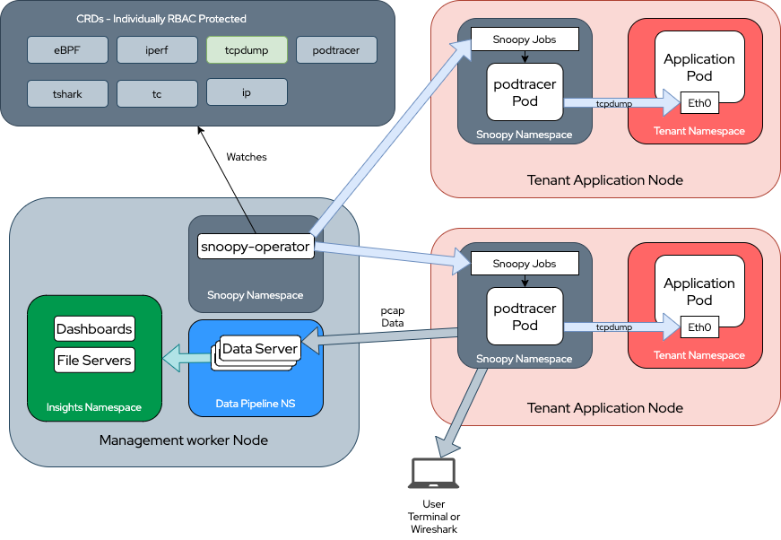

# snoopy-operator

### Community Meetings

Public calendar with regular meetings for 2022 will be available soon.

---

### A Cloud Native Way for Pod Deep Inspection

How can we get packet captures, network flow information or monitor deeply network communications in multiple pods at the same time and have all that information centralized? How can we troubleshoot certain network performance related issues having the "view" of a pod instead? As if we can see the packets before an external encryption occurs? What if we need to check certain destinations or sessions or connections success rate from pod to pod or from pod to external services?

I'm pretty sure a bunch of tools come up to mind when talking about those challenges. Tools like tcpdump, iperf, tc, iproute suite, eBPF tracing etc. Just using one of them for a single Pod is already a challenge. But how can we use them spread over a large cluster on specific pods, namespaces and nodes? Doing that seamlessly without disturbing or changing kubernetes resources at all?

That's the motivation behind the snoopy-operator. Snoopy, for short, manages multiple jobs running special tools against selected or labeled pods across multiple nodes collecting valuable information without changing the pod's object or affecting the pod's cpu budget for example.

### Architecture In a Nutshell

In order to achieve it's results it makes use of [podtracer](https://github.com/fennec-project/podtracer) a utility that makes incredibly easy running all those mentioned tools and many others targeting pods and, more specifically, containers inside those pods. By using podtracer instances as Scheduled Job instances many vital pieces of information can be captured and transferred to a central location from many different nodes at the same time.

</img>

### Road Map

At this moment snoopy-operator can run podtracer through its jobs and use networkign tools to accomplish desired tasks targeting labeled Pods. For the moment only network related tools have been successfuly tested. Among many desired features we highlight a few that are part of our community discussions below:

- Send the retrieved data to a central server (Kafka for ex.) to be consumed by specialized processes as part of a data processing pipeline.
- Including tools that can go beyond networking when needed.
- Including eBPF filters for security monitoring.
- The creation of a data pipeline and dashboard to analyze and publish results.

### Install Instructions

#### Snoopy operator uses two custom resource definitions: 

#### 1) Snoopy Data Endpoint. 

The data endpoint is a workload that carries a gRPC server to gather all the data captured from target pods. For now all it takes is a service name and a service port.

Here is an example CR for SnoopyDataEndpoint:
```
apiVersion: data.fennecproject.io/v1alpha1
kind: SnoopyDataEndpoint
metadata:
  name: snoopydataendpoint-sample
spec:
  serviceName: snoopy-data-svc
  servicePort: 51001
```

#### 2) Snoopy Jobs

The snoopy jobs are kubernetes jobs or kubernetes cronjobs depending on the desired configuration. If you use the schedule field with the same syntax string as a Linux or kubernetes cronjob it becomes a cronjob. If not it runs once immediately as a simple Job. Those jobs execute Pods running the [podtracer](https://github.com/fennec-project/podtracer) tool.

Here is an explained CR for SnoopyJob:

```
apiVersion: job.fennecproject.io/v1alpha1
kind: SnoopyJob
metadata:
  name: snoopy-samplejob
spec:
  command: "tcpdump"
  args: "-n -i eth0"
  labelSelector: { 
    networkMonitor: "true",
    }
  targetNamespace: cnf-telco
  timer: "2m"
  dataServiceIP: "172.30.217.41"
  dataServicePort: "51001"
```

<b>command</b>: The command, tool or task to be run against your Pod. Examples would be `tcpdump`, `iperf`, `ip` etc.

<b>args</b>: The arguments to those commands. For example with `tcpdump` it would be everything that comes after the command itself like `-ni eth0 -w myfile.pcap` etc.

<b>labeSelector</b>: The label selector is what allows the snoopy operator to find the target pods. So pods labeled with that label will be the ones listed as targets for the tool being used.

<b>targetNamespace</b>: Snoopy Operator targets one Kubernetes Namespace per SnoopyJob CR instance. So it will look for the pods with the label informed on that particular namespace.

<b>schedule</b>: The filed schedule will transfor the snoopy job in Kubernetes cronjob and allow the task or tool to be run on a repeated scheldule. It works exactly as in the good old Linux cronjob syntax. Please see https://en.wikipedia.org/wiki/Cron.

<b>timer</b>: The timer field accepts formats like 10s for seconds, 2m for minutes, 1h for hours and 5d for days or combination of those. From golang [time](https://pkg.go.dev/time#ParseDuration) package : 

  <I>A duration string is a possibly signed sequence of decimal numbers, each with optional fraction and a unit suffix, such as "300ms", "-1.5h" or "2h45m". Valid time units are "ns", "us" (or "µs"), "ms", "s", "m", "h"."</I>


<b>dataServiceIP</b>: The data service IP is the ip address of the SnoopyDataEndpoint service created previously. That is a gRPC service collecting the data captured by the SnoopyJobs.

<b>dataServicePort</b>: The data service port is what the name implies. The port used for the SnoopyDataEndpoint service where it listens to new connections.

### Step by Step example:

First let's clone the project and enter the projects directory:
```
git clone https://github.com/fennec-project/snoopy-operator.git
cd snoopy-operator 
```
#### Step 0: If you don't have target Pods

You can use the sample deployment that can be found at config/samples/sample-deployment-ping-traffic.yaml. It will create a namespace called cnf-telco, a service account and a sample deployment with 1 Pod. The Pod is already labeled with the label with networkMonitor=true in order to be found by Snoopy Operator. They will keep pinging a public address to generate trafffic. With that we have traffic going out the primary network interface eth0 on that Pod that can be inspected by another job running tcpdump for example.

Let's create the sample deployment first:
```
kubectl apply -f config/samples/sample-deployment.yaml
```
You should see something like below:

```
namespace/cnf-telco created
serviceaccount/cnf-telco-sa created
deployment.apps/cnf-example-pod created
```

#### Step 1: Deploying the Operator Itself

Then deploy the operator by running:
```
kubectl apply -f config/install/snoopy-operator.yaml
```
This command will deploy all the manifests needed to run the operator. Namespace creation, service accounts and other RBAC resources and the operator deployment itself.

You should see something like this:
```
namespace/snoopy-operator created
customresourcedefinition.apiextensions.k8s.io/snoopydataendpoints.data.fennecproject.io created
customresourcedefinition.apiextensions.k8s.io/snoopyjobs.job.fennecproject.io created
serviceaccount/snoopy-operator-sa created
role.rbac.authorization.k8s.io/leader-election-role created
clusterrole.rbac.authorization.k8s.io/snoopy-operator-role created
rolebinding.rbac.authorization.k8s.io/leader-election-rolebinding created
clusterrolebinding.rbac.authorization.k8s.io/crb-scc-priv-snoopy-operator created
clusterrolebinding.rbac.authorization.k8s.io/snoopy-operator-rolebinding created
configmap/manager-config created
deployment.apps/snoopy-operator created
```

After that you shoud be able to see the operator pod running in the snoopy-operator namespace.
```
kubectl get pods -n snoopy-operator
NAME                              READY   STATUS    RESTARTS   AGE
snoopy-operator-ff7889898-p2rm4   1/1     Running   0          13m
```

#### Step 2: Creating a SnoopyDataEnpoint to collect data:

You can find a sample CR for snoopyDataEndpoints at config/samples/data_v1alpha1_snoopydataendpoint.yaml. We just need to apply to the cluster:

```
kubectl apply -f config/samples/data_v1alpha1_snoopydataendpoint.yaml
```

That should leave us with a new Pod and new Service in the snoopy-operator namespace:

```
kubectl get pods -n snoopy-operator
NAME                              READY   STATUS    RESTARTS   AGE
snoopy-data-5dd97b6b69-wx8fm      1/1     Running   0          4s
snoopy-operator-ff7889898-p2rm4   1/1     Running   0          16m
```

And for the Service:
```
oc get svc -n snoopy-operator
NAME              TYPE        CLUSTER-IP       EXTERNAL-IP   PORT(S)     AGE
snoopy-data-svc   ClusterIP   172.30.228.157   <none>        51001/TCP   71s
```

#### Step 3: Running the desired Jobs against the target Pods:

Assuming that we already have the target Pod running on a specific target Kubernetes Namespace and that it's already labeled with networkMonitor=true, which is the case with our sample-deployment-ping-traffic.yaml, we may proceed from here.
```
apiVersion: job.fennecproject.io/v1alpha1
kind: SnoopyJob
metadata:
  name: snoopy-samplejob
spec:
  command: "tcpdump"
  args: "-i eth0 -U -w -"
  labelSelector: { 
    networkMonitor: "true",
    }
  targetNamespace: cnf-telco
  timer: "2m"
  dataServiceIP: "snoopy-data-svc.snoopy-operator.svc.cluster.local"
  dataServicePort: "51001"
```

You can find the sample job and change it at config/samples/job_v1alpha1_snoopyjob.yaml. Then apply the file to Kubernetes:
```
kubectl apply -f config/samples/job_v1alpha1_snoopyjob_packet_capture.yaml
```
That will spin up your podtracer job Pods that are responsible for finding the target Pods and capture data from them. For now it creates one Pod by target Pod to execute the task. In this example we're using tcpdump with a 2 minutes timer set. And no worries about what node the target Pod is running. Snoopy operator is in charge of that and schedules the job workload on the right node.
```
kubectl get pods -n snoopy-operator
NAME                                                   READY   STATUS    RESTARTS   AGE
snoopy-data-747ff95898-jv964                           1/1     Running   0          3m13s
snoopy-job-cnf-example-pod-6796b4cb8f-dv7r5--1-58jlf   1/1     Running   0          4s
snoopy-operator-7678cccd8c-fgf7w                       1/1     Running   0          119m
```

#### Step 4: Retrieving the Data Captured from the Desired Pods

Data will flow out and land on the snoopy-data Pod where the gRPC data collector server is running. By logging int the data pod we can see a new file under the pcap folder. That's our pcap file with raw data inside.

```
kubectl exec -it snoopy-data-747ff95898-jv964 -- /bin/bash
bash-5.1# ls pcap/
cnf-example-pod-6796b4cb8f-dv7r5
```

We can use `kubectl cp snoopy-data-747ff95898-jv964:/pcap .` to download that file and open it on wireshark.

</img>

## How to contribute

### Community Meetings

Our meetings happen every Wednesday at 1pm Eastern Time.

Snoopy Community Meeting<br>
Wednesday at 1:00 – 2:00pm EST<br>
Google Meet joining info:<br>
[Click here to join the meeting](https://meet.google.com/mvw-ykhv-rin)<br>

[Click here to check the meeting notes](https://docs.google.com/document/d/1RFFSaScSw-hSxEBOLEOT3CPM2S1EVmvQQ8rJ_TxEkJw/edit#)


### Development

Requirements: 

- Go1.15+
- Any Linux distribution
- Docker or Podman for image building
- operator-sdk 1.16+

Building from source:

```
make build
```
Set the container image BUILDER and IMG variables in the Makefile available at root of the project to your desired values.

Then build and push the container image with:
```
make container-build
make container-push
```

In order to run it locally use:
```
make run
```

A better option for debugging is actually using VSCode itself and running on debug mode.
For details on that please check https://code.visualstudio.com/docs/editor/debugging